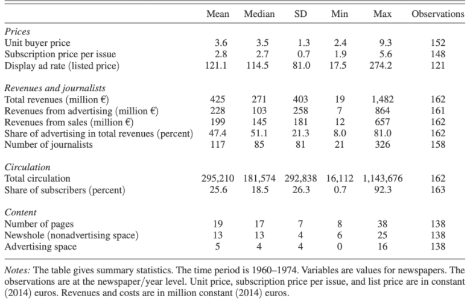
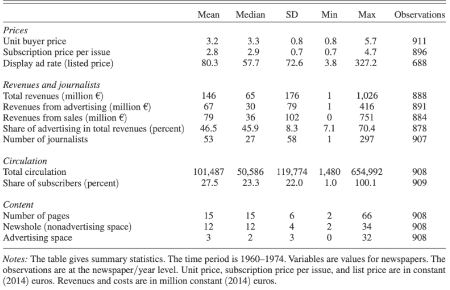

```{r, eval=TRUE, echo=FALSE, warning=FALSE, message=FALSE}
knitr::opts_chunk$set(echo = TRUE)
```

```{r, eval=TRUE, echo=FALSE, warning=FALSE, message=FALSE}
setwd("~/Newspaper_French")
library(tidyverse)
library(haven)
library(here)
library(huxtable)
library(scales)
library(bookdown)
library(tinytex)
library(viridis)
newspapers <- read_dta("Inputs/Angelucci_Cage_AEJMicro_dataset.dta")
newspapers2 <- read_dta("Inputs/Angelucci_Cage_AEJMicro_dataset.dta")
industry <- read_dta("Inputs/Angelucci_Cage_AEJMicro_Descriptive_evidence_advertising_industry.dta")
```

# 1.Introduction

Technology is changing fast, UofT student can take the online course, and cinephile can watch the movie from all around the world through the Internet. We live in a global world, and because of the development of technology, more and more traditional industries face unprecedented challenges; the newspaper is one of them. In China, there are around ten newspaper pull out of the market each year from 2013 to 2017, and the newspaper advertising revenues in China had shrunk from fifty billion yuan (approximately ten billion Canadian dollars) in 2013 to less than 35 (approximately seven billion Canadian dollars) billion yuan in 2017. At this time newspaper has been seriously challenged not only in your own country but also all around the world.

The decrease in advertising revenue is one of the significant parts of the change in the newspaper industry. Why is advertising important? You can take a few seconds to think about the following question: Are advertisements have affection for our purchasing habits? Some people consider that they will not purchase the product introduced by the ad because they are not familiar with this product. In contrast, some people are willing to purchase the product showing in the advertisement when they are shopping. According to the psychology study introduced in Social Psychology by David G. Myers and Christian H.Jordan, even the product is a mere presence in the advertisement; people are more likely to buy this product if they are buying this type of product for the first time. In this case, the advertiser needs such media as newspaper, television and the Internet to attract millions of people's attention. The newspaper used to be the most important media for them to attract consumers, but since the emergence of television and the Internet, we have entered an era of media diversification. Newspaper is not the only way to introduce an advertiser's product.

In this report, we used the difference-in-differences method to analyze that the national newspapers were affected by the introduction of television from the dataset on French newspapers between 1960 and 1974. In the data part, I briefly introduce the dataset and the variable that I used, which is important for the rest of the part. Since the introduction of television did not impact the local newspaper, I take the national newspaper as the treatment group and the local newspaper as the control group in the model part. For the result and discussion part, I mainly focus on the number and explain them. Besides, there are more details in the discussion part and some weaknesses for this report.


# 2.Data

## 2.1 General Background

```{r, eval=TRUE, echo=FALSE, warning=FALSE, message=FALSE}
# Code provided by: Rohan Alexander(2020) Difference in differences https://www.tellingstorieswithdata.com/06-03-matching_and_differences.html

newspapers <- 
  newspapers %>% 
  dplyr::select(
    year, id_news, after_national, local, national, # Difference in differences variables
    ra_cst, qtotal, ads_p4_cst, ads_s, # Advertising side dependents
    ps_cst, po_cst, qtotal, qs_s, rs_cst) %>% #Reader side dependents
  mutate(ra_cst_div_qtotal = ra_cst / qtotal) %>% # An advertising side dependents needs to be built
  mutate_at(vars(id_news, after_national, local, national), ~as.factor(.)) %>% # Change some to factors
  mutate(year = as.integer(year))

```

```{r, eval=TRUE, echo=FALSE, warning=FALSE, message=FALSE}

newspapers2 <-
  newspapers2 %>%
  dplyr::select(
    year, id_news, after_national, local, national, # Difference in differences variables
    share_Hard, news_hole, pages, nb_journ,) # Quality dependents


```


  Angelucci and Cagé collect the data on prices, revenues, and circulation from the French Ministry of Information's non-publicly available records in the National archives. The French Ministry of Information asked newspapers to report their revenues and price every year. The French newspaper industry can be divided into two parts: the local newspaper industry and the national daily newspaper industry, for this report, including 68 local newspapers' data and 12 national newspapers' data ( There were 14 national newspapers at the beginning which is 1960, and 12 national newspaper at the end). The difference between the national newspaper and local newspaper is that the sales territory and the content. 
  
  I choose the variable that I am interested in. Using the variable, id_news(newspaper code), year, local(dummy variable), national(variable), and after_national variable for the difference-in-differences variables. The after_national variable can be explained by multiplying the national dummy variable (1 if it is a national newspaper, 0 if it is others) with the post TV advertisement (1 if there only happened after 1967). The French government relaxed the prohibition of the advertisement on TV. This variable is important because we want to figure out that the advertising revenue on TV did affect the advertising revenue in the newspaper. 
  
  In the advertising side, I am using the ra_cst (revenues from advertising), qtotal (total circulation), ads_p4_cst (Display advertisement rate in media) and ads_s (share of advertising in percentage) in the analysis. Additionally, building an additional dependent that is ra_cst divided by qtotal, which we can get the advertising revenue for each circulation. 

  As for the reader side,  I take ps_cst (subscription price per issue), po_cst (Unit buyer price), qtotal, qs_s (share of subscribers) and rs_cst (revenues from sales) in the newspapers' reader side. The subscription price per issue is different from the unit price. Subscribers actually purchase the whole year newspaper; in other words, the cost of subscription per issue is relatively lower than the unit price.

  After that, I choose the variable which focuses on the newspaper itself. Taking the number of journalists, the number of pages, newshole and the share of hard news to understand the quality of national newspaper after the introduction of television.
  

## 2.2 Summary Statistic

### Table 1: National Newspapers  




### Table 2: Local Newspapers




### Characteristics 

National newspapers can be purchased in the entire France, however, local newspapers are more focusing on the local market. This may explain that the national daily newspapers can provide 425 million euros in the total revenues each year, as for the local daily newspapers, which can also provide 145 million euros during the same period. For the national newspaper, there are around 26 percent pages focusing on the advertising and the percentage of local newspaper is 20 percent on average. In addition, more than 50 percent revenue comes from advertising for the national newspaper and the percentage is 8 percent lower for local newspaper.

\newpage
## 2.3 Scatterplot 

  After introducing some basic data information and summary statistics, I want to show the advertising revenue before and after 1967, for both the local newspaper and the national newspaper industry. Thanks to Rohan Alexander for making this plot in the case study of difference-in-differences. From the figure X, we can clearly find that the local newspaper industry did not affect by the introduction of television which also Angelucci and Cagé, 2019, argued that only the national newspaper would be affected. But we cannot find the exact trend for the revenue of the national newspaper. We may consider that the national newspaper decrease since the introduction of the newspaper, the plot did not give an obvious trend which we can explain more in the following part and discuss the result.

```{r, eval=TRUE, echo=FALSE, warning=FALSE, message=FALSE}

# Code provided by: Rohan Alexander (2020) Difference in differences https://www.tellingstorieswithdata.com/06-03-matching_and_differences.html

newspapers %>% 
  mutate(type = if_else(local == 1, "Local", "National")) %>% 
  ggplot(aes(x = year, y = ra_cst)) +
  geom_point(alpha = 0.5) +
  scale_y_continuous(labels = dollar_format(prefix="$", suffix = "M", scale = 0.000001)) +
  labs(x = "Year",
       y = "Advertising revenue",
       caption = "Source : Rohan Alexander(2020) Difference in differences ") +
  facet_wrap(vars(type),
               nrow = 2) +
  theme_classic() +
  geom_vline(xintercept = 1966.5, linetype = "dashed")

```

# 3.Model

## 3.1 Choice of regression

  In this report, I just use regular linear regression to predict the outcome. Linear regression is used when we want to predict the value of a variable based on the value of another variable. The variable we want to predict is called the dependent variable. For our topic, we want to figure out that the national newspapers were affected by the television advertising change in French. For the model construction, the advantage of using the linear regression for computing difference-in-differences analysis is that regression can help us control potential differences in that we can get an unbiased estimate, and it can also improve the precision of the estimation. The variable ln(yn,t) is the outcome that we are interested in.


## 3.2 Model Construction

The model that we are interested in is shown below : 

$$
ln(yn,t)=\beta_0  + \beta_1(D_{national} \times D_{1960onward}+\lambda_{n} + \gamma_{y} + \epsilon_{n}    
$$

1. n indexes newspapers

2. t indexes years 

3. λn is a fixed effect for each newspaper

4. γy is a fixed effect for each year  

5. For the Beta1, using the indicator variable for national newspapers (14 national newspaper industry at the beginning of the period and 12 at the end) multiplying with the dummy variable that is after the year 1967(i.e., the French government relaxed the prohibition in 1967)


# 4.Result

```{r, eval=TRUE, echo=FALSE, warning=FALSE, message=FALSE}

Name <- as.factor(c('1967 National newspapers', '1974 National newspapers', '1967 Local newspapers', '1974 Local newspapers', '1967 Television', '1974 Television'))

Year <- rep(c(1967,1974), times = 3)

National_revenue <- industry %>%  # Find the total national newspapers' revenue in the industry
  select(adpqn)

colnames(National_revenue)[colnames(National_revenue) == "adpqn"] <- "Revenue" 

Local_revenue <- industry %>% # Find the total local newspapers' revenue in the industry
  select(adpqr)

colnames(Local_revenue)[colnames(Local_revenue) == "adpqr"] <- "Revenue" 

TV_revenue <- industry %>% # Find the total television's revenue in the industry
  select(adtv)

colnames(TV_revenue)[colnames(TV_revenue) == "adtv"] <- "Revenue" 

Revenue <- combine(National_revenue,Local_revenue,TV_revenue)

df_revenue <- data_frame(Name,Year,Revenue) 

```

```{r, eval=TRUE, echo=FALSE, warning=FALSE, message=FALSE}

ggplot(df_revenue, aes(x =  Name, y = Revenue, fill = Year)) +
  geom_bar(stat = "identity") + coord_flip() + scale_x_discrete(limits = c('1967 National newspapers', '1974 National newspapers', '1967 Local newspapers', '1974 Local newspapers', '1967 Television', '1974 Television')) + 
  # Create bar plot for the different media and their revenue under each year.
  theme_classic(base_size = 12) +
  labs(x = "Media", 
       y = "Revenue (constant 2014) euros", 
       title = "Advertising revenue in 1967 and 1974 \n for television local and national newspaper",
       tag = "Figure 1",
       caption = "Source : Institut de Recherches et d’Etudes Publicitaires") +
  theme(plot.title = element_text(hjust = 0.2)) 

```

  In 1967, the French government reformed the prohibition of television advertising. In other words, the commercial advertisement was able to broadcast on French television, and the first advertisement of French television was broadcast in October 1968. From figure 1, we can have an intuitive feeling that compared with the revenue in 1967, national newspapers' advertising revenue did decrease in 1974. On the other hand, the advertising revenue of local newspapers did increase, even under the introduction of television advertisements.


## 4.1 Advertising Side
Table 3
```{r, eval=TRUE, echo=FALSE, warning=FALSE, message=FALSE}

# Code provided by: Rohan Alexander(2020) Difference in differences https://www.tellingstorieswithdata.com/06-03-matching_and_differences.html

# Advertising side
ad_revenue <- lm(log(ra_cst) ~ after_national + id_news + year, data = newspapers)
ad_revenue_div_circulation <- lm(log(ra_cst_div_qtotal) ~ after_national + id_news + year, data = newspapers)
ad_price <- lm(log(ads_p4_cst) ~ after_national + id_news + year, data = newspapers)
ad_space <- lm(log(ads_s) ~ after_national + id_news + year, data = newspapers)

```    

```{r, eval=TRUE, echo=FALSE, warning=FALSE, message=FALSE}

# Code provided by: Rohan Alexander(2020) Difference in differences https://www.tellingstorieswithdata.com/06-03-matching_and_differences.html

omit_me <- c("(Intercept)", "id_news3", "id_news6", "id_news7", "id_news13", 
             "id_news16", "id_news25", "id_news28", "id_news34", "id_news38", 
             "id_news44", "id_news48", "id_news51", "id_news53", "id_news54", 
             "id_news57", "id_news60", "id_news62", "id_news66", "id_news67", 
             "id_news70", "id_news71", "id_news72", "id_news80", "id_news82", 
             "id_news88", "id_news95", "id_news97", "id_news98", "id_news103", 
             "id_news105", "id_news106", "id_news118", "id_news119", "id_news127", 
             "id_news136", "id_news138", "id_news148", "id_news151", "id_news153", 
             "id_news154", "id_news157", "id_news158", "id_news161", "id_news163", 
             "id_news167", "id_news169", "id_news179", "id_news184", "id_news185", 
             "id_news187", "id_news196", "id_news206", "id_news210", "id_news212", 
             "id_news213", "id_news224", "id_news225", "id_news234", "id_news236", 
             "id_news245", "id_news247", "id_news310", "id_news452", "id_news467", 
             "id_news469", "id_news480", "id_news20040", "id_news20345", 
             "id_news20346", "id_news20347", "id_news20352", "id_news20354", 
             "id_news21006", "id_news21025", "id_news21173", "id_news21176", 
             "id_news33718", "id_news34689", "id_news73")

huxreg("Ad. rev." = ad_revenue, 
       "Ad rev. div. circ." = ad_revenue_div_circulation, 
       "Ad price" = ad_price, 
       "Ad space" = ad_space,
        omit_coefs = omit_me, 
        number_format = 2
        )
```

We assume that the introduction of advertising on television was a negative impact on the national newspaper industry more severely than the local newspaper industry. From table 3, comparing with the revenue in the local newspaper, the national newspaper decrease by 23 percent in the advertising revenues. As for the advertising price, we can clearly find the difference, with a 31 percent decrease in the advertising price of the national newspaper than the local newspapers. The total revenue divided by circulation was also decreased by 14 percent. Interestingly, for the advertising space, there was a slight difference between them. For the precision of the estimation, we can find that the first three dependents variables, the R-Squared is nearly close to 90 percent or higher than 90 percent. If the R-Squared value is higher than 90 percent, we can consider we have a very good measurement.


## 4.2 Reader side 
Table 4
```{r, eval=TRUE, echo=FALSE, warning=FALSE, message=FALSE}

# Code provided by: Rohan Alexander(2020) Difference in differences https://www.tellingstorieswithdata.com/06-03-matching_and_differences.html

# Consumer side
subscription_price <- lm(log(ps_cst) ~ after_national + id_news + year, data = newspapers)
unit_price <- lm(log(po_cst) ~ after_national + id_news + year, data = newspapers)
circulation <- lm(log(qtotal) ~ after_national + id_news + year, data = newspapers)
share_of_sub <- lm(log(qs_s) ~ after_national + id_news + year, data = newspapers)
revenue_from_sales <- lm(log(rs_cst) ~ after_national + id_news + year, data = newspapers)
```

```{r, eval=TRUE, echo=FALSE, warning=FALSE, message=FALSE}

# Code provided by: Rohan Alexander(2020) Difference in differences https://www.tellingstorieswithdata.com/06-03-matching_and_differences.html

omit_me <- c("(Intercept)", "id_news3", "id_news6", "id_news7", "id_news13", 
             "id_news16", "id_news25", "id_news28", "id_news34", "id_news38", 
             "id_news44", "id_news48", "id_news51", "id_news53", "id_news54", 
             "id_news57", "id_news60", "id_news62", "id_news66", "id_news67", 
             "id_news70", "id_news71", "id_news72", "id_news80", "id_news82", 
             "id_news88", "id_news95", "id_news97", "id_news98", "id_news103", 
             "id_news105", "id_news106", "id_news118", "id_news119", "id_news127", 
             "id_news136", "id_news138", "id_news148", "id_news151", "id_news153", 
             "id_news154", "id_news157", "id_news158", "id_news161", "id_news163", 
             "id_news167", "id_news169", "id_news179", "id_news184", "id_news185", 
             "id_news187", "id_news196", "id_news206", "id_news210", "id_news212", 
             "id_news213", "id_news224", "id_news225", "id_news234", "id_news236", 
             "id_news245", "id_news247", "id_news310", "id_news452", "id_news467", 
             "id_news469", "id_news480", "id_news20040", "id_news20345", 
             "id_news20346", "id_news20347", "id_news20352", "id_news20354", 
             "id_news21006", "id_news21025", "id_news21173", "id_news21176", 
             "id_news33718", "id_news34689", "id_news73")

huxreg("Subscription price" = subscription_price, 
       "Unit price" = unit_price, 
       "Circulation" = circulation, 
       "Share of sub" = share_of_sub,
       "Revenue from sales" = revenue_from_sales,
       omit_coefs = omit_me, 
       number_format = 2
       )
```

We not only want to know the impact on the newspaper itself, but also we want to analyze how this affects the price of a newspaper depends on different sales mode, annually subscription and retail. With the introduction of television, We observe a 4 percent decrease in the subscription price of the national newspapers industry compared to the local newspaper industry. However, as for the unit price, we find that the national newspaper did increase their unit price more even under the negative shock by the television. In addition, we also get a 19 percent increasing in the share of subscribers. As for the total circulation and the revenue from sales, there are more associated with each other. Both of them decrease 6 percent compared with the local newspaper industry. 

\newpage
## 4.3 Quality
Table 5
```{r, eval=TRUE, echo=FALSE, warning=FALSE, message=FALSE}

# Quality

Number_of_journalists <- lm(log(nb_journ)~ after_national + id_news + year, data = newspapers2)
Number_of_pages <- lm(log(pages)~ after_national + id_news + year, data = newspapers2)
News_hole <- lm(log(news_hole)~ after_national + id_news + year, data = newspapers2)
Share_of_hard_news <- lm(log(share_Hard)~ after_national + id_news + year, data = newspapers2)
```

```{r, eval=TRUE, echo=FALSE, warning=FALSE, message=FALSE}
omit_me <- c("(Intercept)", "id_news3", "id_news6", "id_news7", "id_news13", 
             "id_news16", "id_news25", "id_news28", "id_news34", "id_news38", 
             "id_news44", "id_news48", "id_news51", "id_news53", "id_news54", 
             "id_news57", "id_news60", "id_news62", "id_news66", "id_news67", 
             "id_news70", "id_news71", "id_news72", "id_news80", "id_news82", 
             "id_news88", "id_news95", "id_news97", "id_news98", "id_news103", 
             "id_news105", "id_news106", "id_news118", "id_news119", "id_news127", 
             "id_news136", "id_news138", "id_news148", "id_news151", "id_news153", 
             "id_news154", "id_news157", "id_news158", "id_news161", "id_news163", 
             "id_news167", "id_news169", "id_news179", "id_news184", "id_news185", 
             "id_news187", "id_news196", "id_news206", "id_news210", "id_news212", 
             "id_news213", "id_news224", "id_news225", "id_news234", "id_news236", 
             "id_news245", "id_news247", "id_news310", "id_news452", "id_news467", 
             "id_news469", "id_news480", "id_news20040", "id_news20345", 
             "id_news20346", "id_news20347", "id_news20352", "id_news20354", 
             "id_news21006", "id_news21025", "id_news21173", "id_news21176", 
             "id_news33718", "id_news34689", "id_news73")

huxreg("Number of Journalists" = Number_of_journalists,
       "Number of pages" =  Number_of_pages,
       "Newshole" =  News_hole,
       "Share of hard news" = Share_of_hard_news,
       omit_coefs = omit_me, 
       number_format = 2
       )
```

From table 5, we can see that the introduction of television causes an 8 percent decrease in the number of journalists. As for the number of pages, there is a 7 percent decrease in the number of pages in the national newspaper. Newshole can be explained by the amount of space in the newspaper devoted to anything but advertising (Angelucci and Cagé, 2019) also decrease by 12 percent. For the share of hard news, because the R-squared is 0, so this is definitely not a good measurement, and we give up on analyzing this dependent. 


\newpage
# 5.Discussion

## 5.1 Result discussion

  The obvious decrease in the advertising revenues and advertising prices can be explained by the impact of new media - television. It also confirms our main finding that the new platform of advertising did give a negative shock to the traditional business. One of the most direct influence is that the unemployment rate in the traditional newspaper would increase. With the decreasing of total revenue, we can observe that the number of journalists in table 5 did decrease 8 percent. In order to maintain the cost, shedding a large number of employees is one of the most direct methods. If the worker decreased, the quantity of newspaper would also decrease under the same workload. I think there is a number of reasons that can help us explain the decrease in revenue from sales. Changing the price and the newspaper's content are two of the main reasons. People are less interested in the content, and increasing the unit price also causes the increasing the share of subscribers.


## 5.2 General discussion

  National Newspaper and local Newspaper are all related to our daily life, and people receive global news and local sales from them. With the introduction of television, although only one channel was available until 1963 on French television, the times change already started. With more and more channels introduced in French television and the relaxing of television advertisement by the French government, the increasing advertising revenue on TV was an unstoppable trend. National Newspaper in French did face a serious challenge at that time. From this paper, the introduction of TV advertisements did impact the national newspaper industry. Behind this, the advertiser may consider television as a new pathway to attract more customers at that time, which was a wise idea when we see that decision right now. 
  
  Content is one of the reasons that I consider as the decreasing of advertising revenue for the national newspaper. In 1970, nearly 70 percent of French households owned a television(Parasie 2010). Comparing with the content between national newspapers and the television, both of them focus on international events, financial news, and national politics. They have direct competition naturally. Meanwhile, television was more attractive than the newspaper, especially in 1967. For most people, it was the first time to watch the show on television (think about the first time when a child watch an Ipad); it was interesting and novel. As for the local newspaper industry, they mainly report local news with more associated with the local habitant, and this news would not be reported on the national newspaper or television in that the local newspaper industry might not face the same challenge by the television. 
  
  Different types of advertisers may also be part of the reason. For the local advertiser, comparing with the big national company, their industry was relatively small. Advertisement in local newspapers already attracts enough consumers to purchase their product. As for the national company, they are more likely to maximize their profit; in this way, television might be a better option. Television was not luxury in French during that period, and it is more convenient for both advertisers to broadcast and consumers to know than the traditional newspaper.
  
  From the result, we can see that the circulation was also decreased and then it would not be superseded that the revenue from sales also decreased. With the decrease in sales, in order to keep survive in the market, the newspaper has to choose different solutions. Angelucci and Cagé mention in their paper that the drop in advertising revenues induces the newspaper to lower the quality of its content, and as I mentioned above before, reducing the worker is also an idea.  Can we take these types of results as the signal of the decreasing working requirement in this area? I want to focus more on what  Angelucci and Cagéin found in their paper, such as the readership, in the future study. From my perspective, although the effect of the newspaper did decrease with the development of our modern society, the newspaper did play a role, especially under the internet era. For most of the newspaper, they provide the most reliable news. Because there is no threshold on using the Internet, there are more and more rumours on the Internet that would cause global panic, and we can also see the advantage of the newspaper from this aspect.
  
  As for the weakness, because I am lack knowledge of statistics, if there is more explanation in detail in the result part, it will be easier to understand the topic. For the coding part, the reader is more interested to see the graph instead of words. If I can make attractive graphs and associate them with our topic, the paper will be more vivid. Besides that, thanks again to Rohan Alexander for providing useful code with explanation in the case study of difference-in-differences. 
  

# 6.References

- Alexander, R. (2020, November 05). Difference in differences. Retrieved December 21, 2020, from   https://www.tellingstorieswithdata.com/06-03-matching_and_differences.html

- Angelucci, C., &amp; Cagé, J. (2019, August). Newspapers in Times of Low Advertising Revenues. Retrieved December 21, 2020, from https://www.aeaweb.org/articles?id=10.1257%2Fmic.20170306

- David Hugh-Jones (2020). huxtable: Easily Create and Style Tables for LaTeX, HTML and Other Formats. R package version
  5.1.1. https://CRAN.R-project.org/package=huxtable

- Hadley Wickham and Dana Seidel (2020). scales: Scale Functions for Visualization. R package version 1.1.1.
  https://CRAN.R-project.org/package=scales

- Hadley Wickham and Evan Miller (2020). haven: Import and Export 'SPSS', 'Stata' and 'SAS' Files. R package version 2.3.1.   https://CRAN.R-project.org/package=haven

- Kirill Müller (2017). here: A Simpler Way to Find Your Files. R package version 0.1.   https://CRAN.R-project.org/package=here

- Paradie,Sylvain. 2010. Et Maintenant, une Page de Pub : Une Histoire Morale de la Publicité à la Télévision Française. Paris : INA Éditions.

- R Core Team (2020). R: A language and environment for statistical computing. R Foundation for Statistical Computing, Vienna, Austria. URL https://www.R-project.org/.

- Simon Garnier (2018). viridis: Default Color Maps from 'matplotlib'. R package version 0.5.1. https://CRAN.R-project.org/package=viridis

- Yihui Xie (2020). bookdown: Authoring Books and Technical Documents with R Markdown. R package version 0.21.

- Yihui Xie (2020). tinytex: Helper Functions to Install and Maintain TeX Live, and Compile LaTeX Documents. R package   version 0.26.


